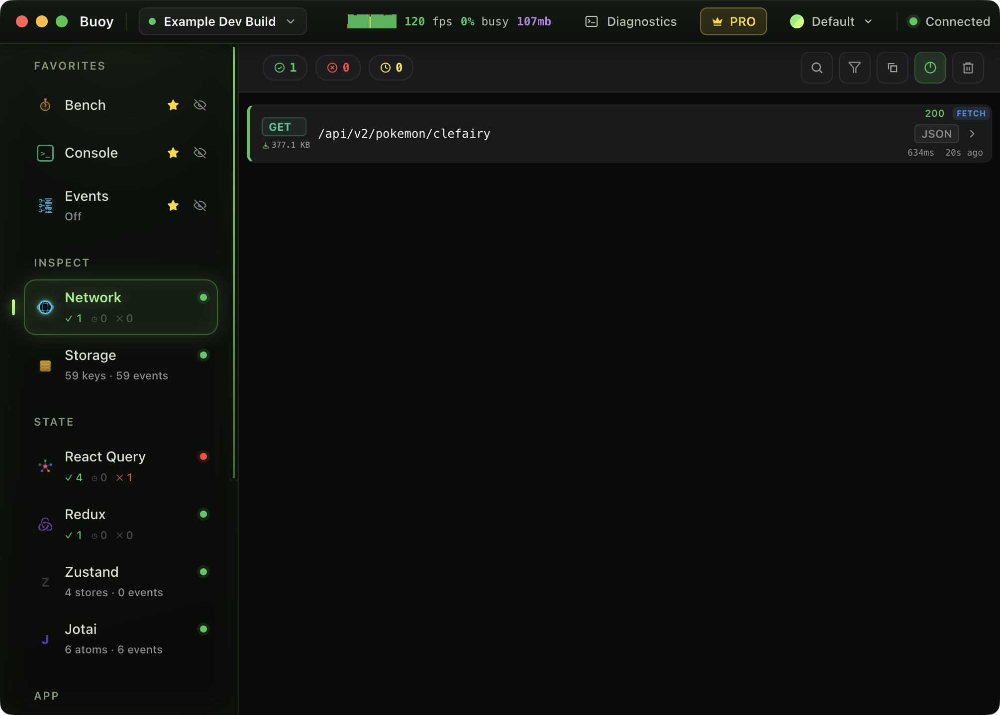

# 🖥️ Buoy Desktop

**Every Buoy tool, full screen.**

[Download](https://github.com/Buoy-gg/Buoy-Desktop/releases/latest) · [Docs](https://buoy.gg/buoy/latest/docs/desktop) · [Get Buoy for your app](https://github.com/Buoy-gg/buoy) · [Pricing](https://buoy.gg/pricing)

Buoy Desktop mirrors the [Buoy devtools](https://github.com/Buoy-gg/buoy) running inside your React Native app to a desktop dashboard — the same live session as the floating menu on the phone and the [MCP server](https://buoy.gg/buoy/latest/docs/mcp) in your editor. One live app, three ways in.

---

## ⬇️ Download & Connect

Buoy Desktop is **free**. Download the zip for your platform from **[Releases](https://github.com/Buoy-gg/Buoy-Desktop/releases/latest)** — macOS, Windows & Linux, x64 + arm64, macOS builds signed and notarized. Unzip, launch. It starts its own local broker on port `42831` and auto-detects devices.

Your app needs [Buoy devtools](https://github.com/Buoy-gg/buoy) installed — the [Quick Start](https://buoy.gg/buoy/latest/docs/quick-start) is one component. The connection is **automatic**: the app derives the broker address from the Metro dev server that served the bundle, so simulators, emulators, and physical devices on the same Wi-Fi all connect with zero config. Only special setups need an explicit `socketURL` (in the `externalSync` prop):

| Setup | Broker URL |
| --- | --- |
| Simulator, emulator, physical device on same Wi-Fi | automatic — nothing to configure |
| Android over USB | automatic — just run `adb reverse tcp:42831 tcp:42831` |
| Expo tunnel mode | `http://<your-computer-ip>:42831` |

> [!NOTE]
> Several devices can connect at once — simulators, physical phones, web, iOS and Android side by side. A title-bar switcher picks which one every tool inspects, mid-session. And the app keeps itself current: it checks for updates on launch and every 10 minutes, downloads in the background, and asks before restarting.

---

## 🧰 What you get

**15 tools in the sidebar**, in 4 groups:

| Group | Tools |
| --- | --- |
| **Inspect** | Network · Storage · Events · Console |
| **State** | React Query · Redux · Zustand · Jotai |
| **App** | Routes · Env · Impersonate · Renders |
| **Capture** | Bench · Screenshot |

Twelve get full-screen panels. React Query renders the real Buoy devtool inline. Screenshot is a one-shot action.

### Live performance HUD

Four channels stream from the device — **UI FPS, JS FPS, CPU, memory**. The HUD learns the device's real refresh ceiling (60, 90, or 120Hz) and colors FPS against *that*, not a hardcoded 60. Per-page stats rank which screens are slow. The dashboard even measures its own FPS — a devtool that watches itself.

### Remote actions

Not a read-only mirror — the dashboard reaches back into the running app:

- **Edit storage** — AsyncStorage, MMKV & SecureStore values, proxied live to the device
- **Drive React Query** — refetch, invalidate & reset queries on a mirrored QueryClient
- **Zustand time travel** — jump to any past state or reset, `setState` forwarded to the device
- **Navigate** — jump to any route, pop-to-index, pop-to-top
- **Gate the firehose** — per-tool capture ON/OFF and per-source event toggles

### Screenshot tool

Captures the booted iOS Simulator. **Component mode** (the default): type a `testID`, `nativeID`, or component name — the device locates it live, scrolls it into view, re-measures, and returns a tight auto-crop. Perfect for pasting into an agent conversation. Region mode: drag a rectangle.

### Diagnostics

A built-in diagnostics console logs device connections and instability — when a device drops, you see why. The broker's own connection log streams in too: handshakes, disconnect reasons, duplicate-name renames, protocol version mismatches — including events from **before** you opened the console, so a failed connect is never invisible.

### Troubleshooting built in

No devices yet? The dashboard shows your machine's exact LAN URLs (`http://<ip>:42831`) with a test you can run straight from the phone's browser, plus a checklist of the common causes. Stale devices don't pile up either — offline entries can be removed with one click and age out on their own after a day.

---

## 💳 Free to use. Pro unlocks the rest.

Buoy Desktop is free — no license needed to download, connect, and watch every tool stream live. **Pro** unlocks full history and unlimited capture (the free tier locks older entries). Activate by pasting a license key into the navbar License button — stored encrypted via the OS keychain — or connect a device that already has one and the dashboard adopts it automatically.

**Weekend Pass:** every Saturday and Sunday, all Pro features unlock free for everyone — the navbar shows a violet WEEKEND PASS badge. Built into the product, not a promo.

Pro is $29/seat/month or $290/year with a 14-day trial — and it also unlocks the [MCP server](https://buoy.gg/buoy/latest/docs/mcp), which gives your agent the same session. ➡️ [buoy.gg/pricing](https://buoy.gg/pricing)

---

## Nothing Leaves Your Machine

> [!IMPORTANT]
> Buoy's tools run inside your app's process and sync to Buoy Desktop over the local broker — localhost only, no cloud, no remote connections. Nothing ever leaves your machine.

---

## Feedback

Found a bug or want a panel that doesn't exist yet? [Open an issue](https://github.com/Buoy-gg/Buoy-Desktop/issues) — feature requests drive the roadmap.

## License

Proprietary software. © Buoy LLC. All rights reserved. See the [Terms of Service](https://buoy.gg/terms).

---

> Looking for the legacy open-source React Query desktop tool that used to live here? It has been superseded by Buoy Desktop, which supports the full Buoy toolset.

You read the whole README. See you Saturday. 🖥️

