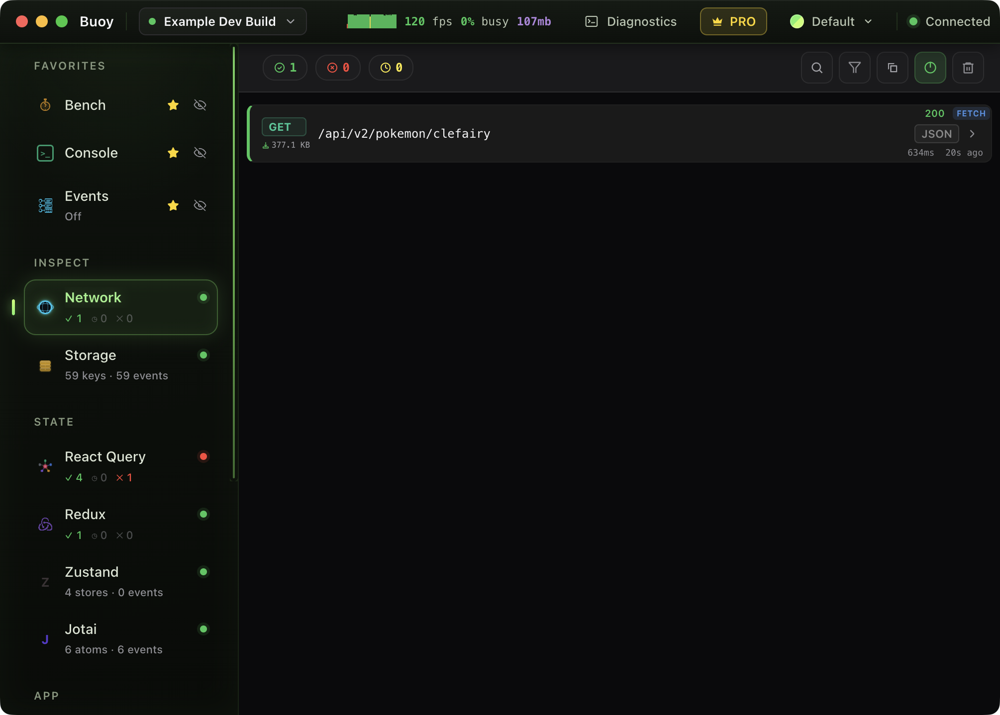

# 🖥️ Buoy Desktop

Inspect connected Buoy tools on your desktop.

[Download](https://github.com/Buoy-gg/Buoy-Desktop/releases/latest) · [Docs](https://buoy.gg/buoy/latest/docs/desktop) · [Get Buoy for your app](https://github.com/Buoy-gg/buoy) · [Pricing](https://buoy.gg/pricing)

Buoy Desktop mirrors the [Buoy devtools](https://github.com/Buoy-gg/buoy) running inside your React Native app — and, in beta, your [Flutter app](https://github.com/Buoy-gg/Buoy-Flutter) — to a desktop dashboard: the same live session as the floating menu on the phone and the [MCP server](https://buoy.gg/buoy/latest/docs/mcp) in your editor. One live app, four ways in — the fourth being [Ask Buoy](https://buoy.gg/buoy/latest/docs/tools/ask-buoy), the in-app AI chat, which this dashboard mirrors.

---

## ⬇️ Download & Connect

1. Download the appropriate build from [Releases](https://github.com/Buoy-gg/Buoy-Desktop/releases/latest), open it, and sign in to your Free or Pro Buoy account.
2. Follow the [React Native Quick Start](https://buoy.gg/buoy/latest/docs/quick-start) and install `@buoy-gg/external-sync`. Restart Metro and open your app with its account key configured. Desktop sign-in and device sign-in are separate.
3. Select the device in Desktop. Trigger a request or log in your app and confirm that it appears in the matching panel.

Desktop starts a broker on port `42831`. React Native development connections normally derive its address from Metro. A physical device must be able to reach your computer over the network.

| Setup | Connection guidance |
| --- | --- |
| React Native development on the same LAN | Address discovery usually works through Metro. Check the dashboard diagnostics if it does not. |
| Android over USB | Use `adb reverse tcp:42831 tcp:42831` with a device connection to the forwarded port. |
| Expo tunnel | Set `externalSync.socketURL` to `http://<your-computer-ip>:42831`; the phone still needs network access to that address. |
| Flutter physical device | Follow the debug-build setup and pass `socketUrl: 'http://<your-computer-ip>:42831'`. |

See the [Desktop guide](https://buoy.gg/buoy/latest/docs/desktop) for complete configuration, release sync, and troubleshooting. Several devices can connect at once; the title-bar switcher selects the inspected device.

---

## 🧰 What you get

The sidebar groups tools by task. Availability depends on the connected app, installed tools, platform, and plan:

| Group | Tools |
| --- | --- |
| **Inspect** | Network · Storage · Events · Console · Images · Assets · Sentry |
| **State** | React Query · Redux · Zustand · Jotai · Time Machine |
| **App** | Routes · Env · Impersonate · Renders · Scenarios |
| **Capture** | Bench · JS Top · Screenshot · Camera |
| **AI** | Ask Buoy *(beta)* |
| **TV** | TV Remote · Focus Inspector |

**Ask Buoy** is a live, read-only mirror of the in-app AI chat, showing what the agent said, what it changed and what the turn cost, with remote undo. Conversations start in the app. Broker account admission does not replace your app’s authorization checks for remote actions.

Most get full-screen panels. React Query renders the real Buoy devtool inline. Screenshot is a one-shot action.

### Camera (iOS)

Buoy supplies camera feeds to supported iOS Simulator apps on macOS. Choose a webcam, screen region, generated barcode, image, video or test pattern. The app under test does not need the Buoy SDK, but its camera library and capture APIs must support the simulated path.

Desktop requires an account. Webcam, image, video, pattern and QR generation are available at Free limits. Screen-region capture and non-QR generation require Pro access, as do camera MCP actions; `camera_diagnose` is available without the Pro gate.

Enable a source, then launch the app. Relaunch an app that was already running; Fast Refresh does not restart its process. Source changes after attachment do not normally require another relaunch. Grant host permissions for camera or screen capture when requested.

The receiving status confirms frame consumption. Verify the app's scanner callback, photo or recording output separately. Helper-side barcode decoding does not prove that the app decoded the fixture.

The bundled `buoycam` CLI supports source selection, launch, diagnosis and cleanup. Set it up on your PATH before scripting a test. CI needs a configured macOS Simulator runner and native helpers; interactive capture sources also need a suitable logged-in session and permissions. See the [Camera guide](https://buoy.gg/buoy/latest/docs/tools/camera) for setup and compatibility limits.

### Live performance HUD

Depending on the platform and installed native modules, the device can stream UI FPS, JS FPS, CPU, and memory. The HUD learns the device's real refresh ceiling (60, 90, or 120Hz) and colors FPS against *that*, not a hardcoded 60. Per-page stats rank which screens are slow. The dashboard even measures its own FPS — a devtool that watches itself.

### Remote actions

Not a read-only mirror — the dashboard reaches back into the running app:

- **Edit storage** — AsyncStorage, MMKV & SecureStore values, proxied live to the device
- **Drive React Query** — refetch, invalidate & reset queries on a mirrored QueryClient
- **Zustand time travel** — jump to a retained state or reset, `setState` forwarded to the device
- **Navigate** — navigate to supported routes, pop-to-index, pop-to-top
- **Gate the firehose** — per-tool capture ON/OFF and per-source event toggles

### Screenshot tool

Captures the booted iOS Simulator. **Component mode** (the default): type a `testID`, `nativeID`, or component name — the device locates it live, scrolls it into view, re-measures, and returns a tight auto-crop. Perfect for pasting into an agent conversation. Region mode: drag a rectangle.

### Diagnostics

A built-in diagnostics console logs device connections and instability — when a device drops, you see why. The broker's own connection log streams in too: handshakes, disconnect reasons, duplicate-name renames, protocol version mismatches — including events from **before** you opened the console, to help investigate failed connections.

### Troubleshooting built in

No devices yet? The dashboard shows your machine's exact LAN URLs (`http://<ip>:42831`) with a test you can run straight from the phone's browser, plus a checklist of the common causes. Stale devices don't pile up either — offline entries can be removed with one click and age out on their own after a day.

---

## Account and plans

Buoy Desktop is free to download. Sign in to connect and inspect devices. A device key does not sign Desktop in. Pro features and capture limits depend on your account; see [pricing](https://buoy.gg/pricing) for current plans and Weekend Pass terms.

---

## Connections and data

App sessions sync to the configured broker, which can be reachable over your LAN. Use a trusted development network. Desktop and device account validation make network requests; the [Telemetry guide](https://buoy.gg/buoy/latest/docs/telemetry) describes additional development telemetry. Ask Buoy sends requests to your configured model endpoint.

---

## Feedback

Found a bug or want a panel that doesn't exist yet? [Open an issue](https://github.com/Buoy-gg/Buoy-Desktop/issues) — feature requests drive the roadmap.

## License

Proprietary software. © Buoy LLC. All rights reserved. See the [Terms of Service](https://buoy.gg/terms).

---

> Looking for the legacy open-source React Query desktop tool that used to live here? It has been superseded by Buoy Desktop, which supports the full Buoy toolset.
